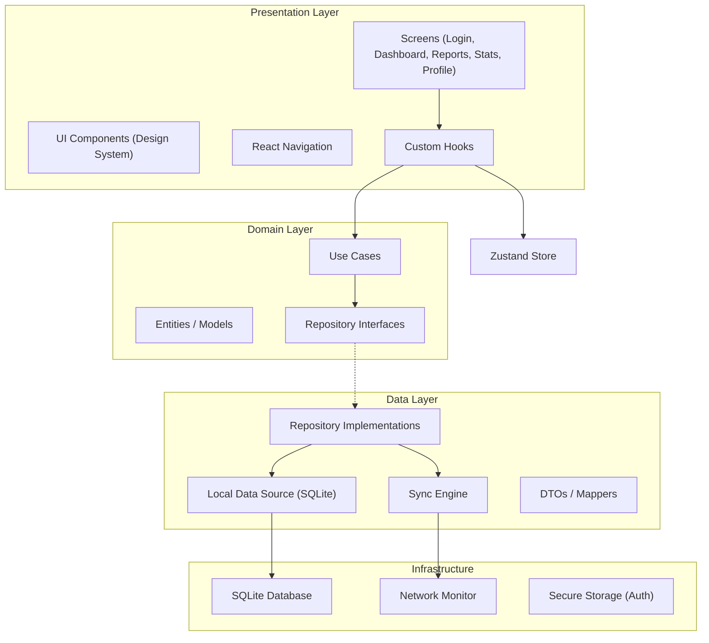
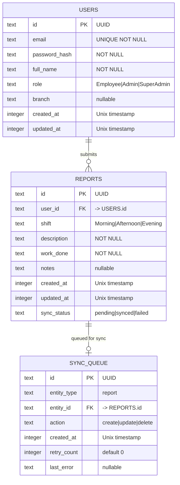
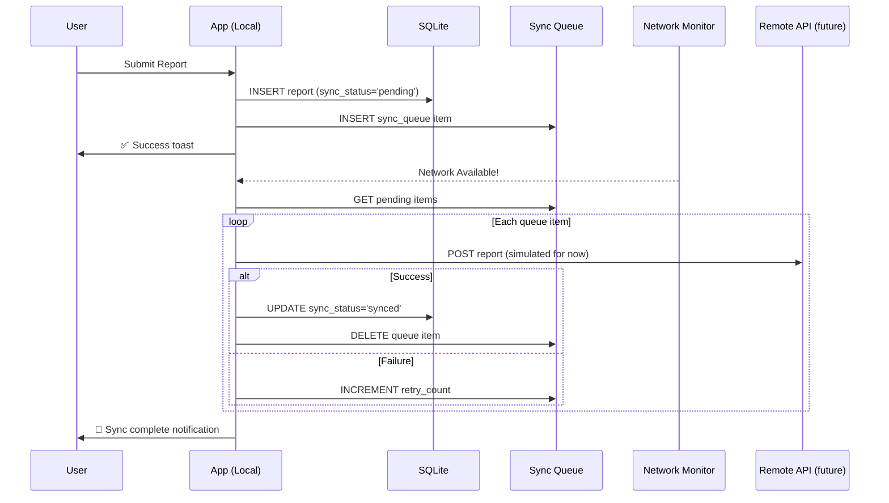

# Reportify — Full Implementation Plan

> **Daily Reporting Mobile App** · React Native · TypeScript · Offline-First · Dark Mode Only

---

## Problem Statement

Build a production-grade mobile app for a doner shop where **employees** submit daily work reports, **admins** review team reports at the branch level, and **super admins** have full cross-branch visibility. The app must work fully offline, sync when connectivity returns, and deliver a premium fintech-inspired dark UI.

---

## Architecture Overview



### Clean Architecture Layers

| Layer | Responsibility | Dependencies |
|---|---|---|
| **Presentation** | UI rendering, navigation, user interaction | Domain (via hooks/stores) |
| **Domain** | Business logic, entities, use case orchestration | None (pure TypeScript) |
| **Data** | Data persistence, sync, DTO mapping | Domain interfaces, Infrastructure |
| **Infrastructure** | Platform APIs, database, network, storage | External libraries |

> [!IMPORTANT]
> **Dependency Rule**: Dependencies point inward only. The Domain layer has ZERO dependencies on Data or Presentation. Repository interfaces are defined in Domain and implemented in Data.

---

## Tech Stack Decisions

| Technology | Choice | Why |
|---|---|---|
| **Framework** | React Native 0.76+ (New Architecture) | Latest stable with Fabric renderer and TurboModules support |
| **Language** | TypeScript (strict mode) | Full type safety, refactoring confidence, IDE support |
| **State Management** | Zustand | Lightweight (~1KB), no boilerplate, excellent TS support, built-in persist middleware — ideal for this app's moderate state complexity |
| **Local Database** | `expo-sqlite` (SQLite) | Battle-tested, offline-first native, relational queries, no abstraction overhead. WatermelonDB adds unnecessary complexity for this scale |
| **Navigation** | React Navigation v7 | Industry standard, type-safe routing, native stack performance |
| **Charts** | `react-native-gifted-charts` | Pure JS (no native linking), dark-mode friendly, bar + line charts with gradient support |
| **Notifications** | `expo-notifications` (local) | Local scheduled reminders, no server required |
| **Secure Storage** | `expo-secure-store` | Keychain/Keystore backed, persists auth session |
| **Network Detection** | `@react-native-community/netinfo` | Reliable connectivity monitoring for sync triggers |
| **Date Handling** | `date-fns` | Lightweight, tree-shakeable, immutable |
| **Project Bootstrap** | Expo SDK 52 (bare workflow) | Fast setup, EAS build pipeline, managed native modules with escape hatch |

> [!NOTE]
> We use **Expo** (managed workflow) for faster development velocity. All chosen libraries are Expo-compatible. We can eject to bare workflow if needed later.

---

## Folder Structure

```
Reportify/
├── app.json
├── App.tsx                          # Root entry — providers, navigation container
├── babel.config.js
├── tsconfig.json
├── package.json
│
├── src/
│   ├── app/                          # App-level setup
│   │   ├── providers/
│   │   │   ├── AppProviders.tsx       # Wraps all context providers
│   │   │   └── DatabaseProvider.tsx   # Initializes SQLite on mount
│   │   └── navigation/
│   │       ├── AppNavigator.tsx       # Root navigator (auth vs main)
│   │       ├── AuthNavigator.tsx      # Login stack
│   │       ├── MainTabNavigator.tsx   # Bottom tab navigator
│   │       └── types.ts              # Navigation param types
│   │
│   ├── domain/                       # Pure business logic — NO dependencies
│   │   ├── entities/
│   │   │   ├── User.ts               # User entity
│   │   │   ├── Report.ts             # Report entity
│   │   │   ├── SyncStatus.ts         # Sync status enum
│   │   │   └── UserRole.ts           # Role enum (Employee, Admin, SuperAdmin)
│   │   ├── repositories/             # Interfaces only
│   │   │   ├── IAuthRepository.ts
│   │   │   ├── IReportRepository.ts
│   │   │   ├── IUserRepository.ts
│   │   │   └── ISyncRepository.ts
│   │   └── usecases/
│   │       ├── auth/
│   │       │   ├── LoginUseCase.ts
│   │       │   ├── LogoutUseCase.ts
│   │       │   └── GetCurrentUserUseCase.ts
│   │       ├── reports/
│   │       │   ├── CreateReportUseCase.ts
│   │       │   ├── GetReportsUseCase.ts
│   │       │   ├── GetReportByIdUseCase.ts
│   │       │   └── DeleteReportUseCase.ts
│   │       ├── sync/
│   │       │   ├── SyncReportsUseCase.ts
│   │       │   └── GetSyncStatusUseCase.ts
│   │       └── stats/
│   │           ├── GetDailyStatsUseCase.ts
│   │           ├── GetWeeklyStatsUseCase.ts
│   │           └── GetMonthlyStatsUseCase.ts
│   │
│   ├── data/                         # Data layer — implements domain interfaces
│   │   ├── database/
│   │   │   ├── DatabaseManager.ts     # SQLite connection, migration runner
│   │   │   ├── migrations/
│   │   │   │   ├── index.ts           # Migration registry
│   │   │   │   ├── 001_create_users.ts
│   │   │   │   ├── 002_create_reports.ts
│   │   │   │   └── 003_create_sync_queue.ts
│   │   │   └── schemas.ts            # Table schemas as constants
│   │   ├── datasources/
│   │   │   ├── local/
│   │   │   │   ├── AuthLocalDataSource.ts
│   │   │   │   ├── ReportLocalDataSource.ts
│   │   │   │   ├── UserLocalDataSource.ts
│   │   │   │   └── SyncLocalDataSource.ts
│   │   │   └── secure/
│   │   │       └── SecureStorageDataSource.ts  # expo-secure-store wrapper
│   │   ├── dto/
│   │   │   ├── ReportDTO.ts
│   │   │   ├── UserDTO.ts
│   │   │   └── SyncQueueItemDTO.ts
│   │   ├── mappers/
│   │   │   ├── ReportMapper.ts        # DTO ↔ Entity
│   │   │   ├── UserMapper.ts
│   │   │   └── SyncMapper.ts
│   │   └── repositories/             # Concrete implementations
│   │       ├── AuthRepository.ts
│   │       ├── ReportRepository.ts
│   │       ├── UserRepository.ts
│   │       └── SyncRepository.ts
│   │
│   ├── presentation/                 # UI layer
│   │   ├── screens/
│   │   │   ├── auth/
│   │   │   │   └── LoginScreen.tsx
│   │   │   ├── dashboard/
│   │   │   │   ├── DashboardScreen.tsx
│   │   │   │   ├── components/
│   │   │   │   │   ├── EmployeeDashboard.tsx
│   │   │   │   │   ├── AdminDashboard.tsx
│   │   │   │   │   └── SuperAdminDashboard.tsx
│   │   │   ├── reports/
│   │   │   │   ├── ReportsListScreen.tsx
│   │   │   │   ├── CreateReportScreen.tsx
│   │   │   │   ├── ReportDetailScreen.tsx
│   │   │   │   └── components/
│   │   │   │       ├── ReportCard.tsx
│   │   │   │       ├── ReportFilters.tsx
│   │   │   │       └── EmptyReports.tsx
│   │   │   ├── statistics/
│   │   │   │   ├── StatisticsScreen.tsx
│   │   │   │   └── components/
│   │   │   │       ├── BarChart.tsx
│   │   │   │       ├── LineChart.tsx
│   │   │   │       └── StatCard.tsx
│   │   │   └── profile/
│   │   │       ├── ProfileScreen.tsx
│   │   │       └── components/
│   │   │           ├── ProfileHeader.tsx
│   │   │           └── PreferenceToggle.tsx
│   │   ├── components/               # Shared UI components (design system)
│   │   │   ├── Button.tsx
│   │   │   ├── Input.tsx
│   │   │   ├── Card.tsx
│   │   │   ├── Badge.tsx
│   │   │   ├── Toast.tsx
│   │   │   ├── BottomSheet.tsx
│   │   │   ├── FAB.tsx
│   │   │   ├── SegmentedControl.tsx
│   │   │   ├── SearchBar.tsx
│   │   │   ├── ProgressBar.tsx
│   │   │   ├── ToggleSwitch.tsx
│   │   │   ├── LoadingSpinner.tsx
│   │   │   └── EmptyState.tsx
│   │   └── hooks/
│   │       ├── useAuth.ts
│   │       ├── useReports.ts
│   │       ├── useSync.ts
│   │       ├── useStats.ts
│   │       └── useNetwork.ts
│   │
│   ├── store/                        # Zustand stores
│   │   ├── authStore.ts
│   │   ├── reportsStore.ts
│   │   ├── syncStore.ts
│   │   └── settingsStore.ts
│   │
│   ├── infrastructure/               # Platform concerns
│   │   ├── network/
│   │   │   └── NetworkMonitor.ts
│   │   ├── notifications/
│   │   │   └── NotificationService.ts
│   │   └── sync/
│   │       └── SyncManager.ts        # Orchestrator: watches network, triggers sync
│   │
│   ├── theme/                        # Design system tokens
│   │   ├── colors.ts
│   │   ├── typography.ts
│   │   ├── spacing.ts
│   │   ├── borderRadius.ts
│   │   └── index.ts                  # Re-exports all tokens
│   │
│   └── utils/
│       ├── dates.ts                  # date-fns helpers
│       ├── uuid.ts                   # UUID generation
│       └── validators.ts            # Input validation
│
└── assets/
    ├── icons/                        # SVG icons
    └── fonts/                        # Custom fonts (if any)
```

---

## Database Schema



---

## Sync Architecture



> [!NOTE]
> **For v1.0**, the sync engine operates locally — it marks reports as "synced" after processing from the queue. The architecture is designed so a real remote API can be plugged in later by simply implementing the remote data source. No changes needed in domain or presentation layers.

---

## Authentication Flow

Since this is local-first with no external server:

1. **Seed users** are created on first app launch (super admin, admin, employee accounts)
2. Login compares email + hashed password against local SQLite
3. Session token stored in `expo-secure-store`
4. `authStore` (Zustand) holds current user + role for the session
5. Navigation resolves auth state on app load → either Login or MainTab

### Seed Users (for demo/production)

| Role | Email | Password |
|---|---|---|
| Super Admin | `superadmin@reportify.app` | `Super@123` |
| Admin | `admin@reportify.app` | `Admin@123` |
| Employee | `employee@reportify.app` | `Employee@123` |

---

## Phased Build Plan

### Phase 1: Core Setup
- Initialize Expo project with TypeScript
- Configure path aliases (`@domain/`, `@data/`, `@presentation/`, etc.)
- Install all dependencies
- Set up theme tokens (colors, typography, spacing, borderRadius)
- Build design system components (Button, Input, Card, Badge, FAB, etc.)

### Phase 2: Database Layer
- Set up SQLite with `expo-sqlite`
- Create migrations (users, reports, sync_queue)
- Build `DatabaseManager` with migration runner
- Implement DTOs and Mappers
- Build all local data sources

### Phase 3: Domain Layer
- Define entities (User, Report, SyncStatus, UserRole)
- Define repository interfaces
- Implement all use cases
- Build repository implementations

### Phase 4: State & Infrastructure
- Set up Zustand stores (auth, reports, sync, settings)
- Build NetworkMonitor
- Build SyncManager
- Build NotificationService

### Phase 5: UI — Auth & Navigation
- Build AppNavigator with auth gate
- Build LoginScreen
- Implement auth flow (login → dashboard)

### Phase 6: UI — Core Screens
- DashboardScreen (3 role variants)
- CreateReportScreen
- ReportsListScreen + ReportDetailScreen
- StatisticsScreen
- ProfileScreen

### Phase 7: Polish & Integration
- Wire sync engine to network events
- Add notification reminders
- Add toast feedback system
- Test offline flow end-to-end
- Empty states and error handling

---

## User Review Required

> [!IMPORTANT]
> **Expo vs Bare React Native**: I'm recommending **Expo (managed workflow)** for faster development. This gives us EAS Build, managed native modules, and faster iteration. We can eject later if needed. **Do you approve using Expo?**

> [!IMPORTANT]
> **No Real Backend in v1.0**: The sync engine will simulate server communication (mark as synced locally). The architecture allows plugging in a real API later with zero domain/UI changes. **Is this acceptable for your first release?**

> [!WARNING]
> **Password Hashing**: For local-only auth, we'll use a simple hash comparison (no bcrypt in RN without native module). For production with a real backend, proper hashing would be server-side. **Acceptable for local-first v1.0?**

---

## Open Questions

1. **Branch names**: The design system mentions branches (North/Central/South). Should I seed these specific branch names, or would you like different ones for your doner shop locations?

2. **Photo attachments**: The Create Report screen mentions "Attach photo" as optional. Should I implement camera/gallery integration in v1.0, or defer to a later release?

3. **Report detail view**: Should tapping a report card show a full detail screen in v1.0, or is the list view sufficient?

4. **Export PDF**: The design mentions "Export PDF" in the long-press menu. Should I implement this in v1.0?

---

## Verification Plan

### Automated Tests
- Run `npx expo start` → verify app boots without errors
- Navigate all screens and verify with browser subagent / Expo Go
- Test offline report submission → verify SQLite persistence
- Test auth flow → login/logout with all 3 seed users
- Test role-based dashboard rendering

### Manual Verification
- Visual inspection of all screens against design system tokens
- Verify dark mode colors, spacing, typography match the spec
- Test on both iOS and Android simulators via Expo Go
- Verify offline-first: airplane mode → submit report → reconnect → verify sync status
